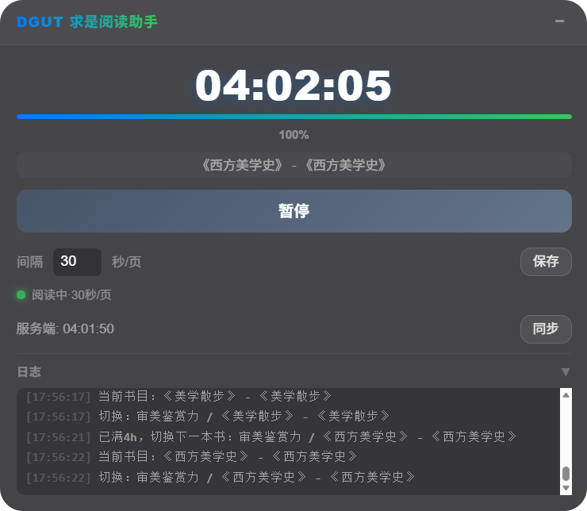

# DGUT 求是读书计划-全自动阅读助手

> 当前版本：**3.2.1** · 适用平台：东莞理工学院优学院【求是读书计划】课件书籍（ua.dgut.edu.cn）

一个浏览器辅助脚本，帮你在莞工求是读书计划里**自动计时 + 自动翻页**，无需手动盯着屏幕翻书，就能完成每本书 4 小时的学分要求。

## 它能做什么

- **自动翻页**：打开课件后自动一页页往后翻，到最后一页会回到开头继续循环
- **自动计时**：后台持续计阅读时间，关掉浏览器再打开也能接着上次的时间继续
- **自动切书/切节**：一本书读满 4 小时后，自动换到下一本；一本书内的多个小节也会自动切换
- **平台时间同步**：每隔几分钟自动和优学院平台对一次时间，确保本地时长 = 服务端真实时长
- **走神提醒自动关闭**：平台偶尔弹出的"你在看吗"确认框会自动帮你点掉
- **可拖拽小面板**：页面右上角会显示一个半透明面板，能拖动、能折叠，不挡视线

## 如何安装

**第一步**：给你的浏览器装一个叫 Tampermonkey 的扩展。

- 如果你用的是 Chrome、Edge 或 Firefox：[点此安装 Tampermonkey](https://www.tampermonkey.net/)
- 如果你用的是国产浏览器（360、QQ、搜狗等），一般在浏览器的"扩展商店"里搜索"Tampermonkey"或"油猴"就能找到

**第二步**：安装本脚本。

- 方式一（推荐）：打开 [Greasy Fork 页面](https://greasyfork.org/zh-CN/scripts/577055)，点"安装此脚本"即可
- 方式二：下载本仓库里的 `DGUT求是读书-全自动阅读助手.js` 文件，打开 Tampermonkey → 添加新脚本 → 把文件内容全部复制进去 → 保存

**第三步**：打开优学院求是读书的课程页面，页面右侧出现小面板就说明安装成功了。

## 面板怎么看

面板展开和折叠时的样子：

| 展开态 | 折叠态 |
|--------|--------|
|  |  |

面板上的信息从上到下依次是：

| 显示内容 | 含义 |
|----------|------|
| **计时数字**（如 01:23:45） | 当前这本书你已经阅读的累计时间 |
| **进度条 + 百分比** | 你距离完成 4 小时学分要求的进度 |
| **书名 - 小节名** | 当前正在读的是哪本书、哪个小节 |
| **主按钮** | 点击可以暂停/继续自动阅读 |
| **间隔设置** | 每隔多少秒翻一页（默认 30 秒，一般不用改） |
| **状态指示灯** | 绿色 = 正常工作中；橙色 = 正在等待页面加载 |
| **服务端时间** | 平台上记录的时间，点"同步"按钮可以手动对齐 |
| **日志区** | 显示脚本做了什么（翻页、切书、同步等），点标题可收起 |

## 使用小贴士

1. **打开课程页面就会自动开始**，不需要手动点开始。如果想暂停，点面板上的按钮就行
2. **换书看是没问题的**：在课程里点击其他书目，脚本会自动保存当前书的进度，开始给新书计时
3. **读完一本书会自动换下一本**，不需要手动操作
4. **每本书需要读 4 小时以上**才算完成学分，脚本会帮你读够时间
5. **不要关掉最后一个标签页**：浏览器可以切到后台干别的，但最好保留一个优学院的标签页开着
6. **一些旧版浏览器可能不支持**：如果发现面板没出来，建议换成 Chrome 或 Edge 浏览器试试

## 常见问题

**问：为什么有时候面板上显示的时间和服务端不一样？**

服务端是平台记录的实际已读时长，每5分钟才会更新一次；脚本每 5 分钟会自动同步一次。短时间内的小差异是正常的。

**问：翻页间隔设多少合适？**

默认 30 秒一页是比较合理的速度，不会太快也不会太慢。如果你觉得太快可以调大，太慢可以调小，但建议不要短于 10 秒。

**问：怎么确认脚本还在正常工作？**

看面板上的状态指示灯——绿色就表示在正常运行。或者看时长是否在持续增长。

## 致谢

本脚本的初版思路参考了以下开源脚本：

- [OortCloud — DGUT优学院求是读书计划](https://greasyfork.org/zh-CN/scripts/571632)
- [ggaaoo — DGUT优学院自动阅读器](https://greasyfork.org/zh-CN/scripts/572461)

## 免责声明

本脚本为开源学习辅助工具，仅供个人学习与研究使用。使用者需自行承担使用风险，作者不对使用本脚本产生的任何后果负责。
