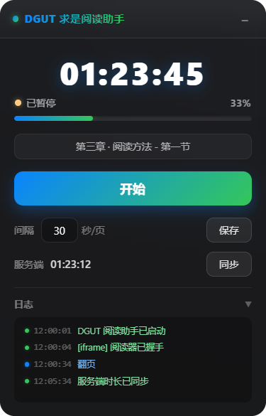

# DGUT 求是读书计划-自动阅读助手

> 当前版本：**3.3.1** · 适用平台：东莞理工学院优学院【求是读书计划】课件书籍（ua.dgut.edu.cn）

一个浏览器脚本，帮你在东莞理工学院【求是读书计划】里自动**计时 + 翻页**，无需手动盯着屏幕翻书，就能完成每本书 4 小时的学分要求。

*通识教育活动学分查询：https://tsjy.dgut.edu.cn/pc/#/creditsSearch*

## 它能做什么

- **自动翻页/切节/切书**：打开课件后自动翻页；书内的多个小节自动切换：一本书读满 4 小时后，自动换到下一本；启动脚本放后台即可
- **持久化计时**：后台统计阅读时间，关掉浏览器再打开，能接着之前累计的时间继续
- **平台时间同步**：每隔 5 分钟和优学院平台对一次时间，确保统计的时长 = 服务端真实时长
- **走神提醒自动关闭**：平台弹出的"你在看吗"确认框会自动帮你点掉

## 如何安装

**第一步**：给浏览器装 Tampermonkey/脚本猫 扩展。

- 如果你用的是 Chrome、Edge 或 Firefox
  - 选择1：[安装 Tampermonkey](https://www.tampermonkey.net/)
  - 选择2：[安装 脚本猫](https://scriptcat.org/)
- 如果你用的是国产浏览器（360、QQ、搜狗等），在浏览器的"扩展商店"搜"油猴"或“脚本猫”就能找到

**第二步**：安装此脚本。

- 方式一：打开 [Greasy Fork 脚本页](https://greasyfork.org/zh-CN/scripts/577055)，点"安装此脚本"
- 方式二：打开 [ScriptCat 脚本页](https://scriptcat.org/zh-CN/script-show-page/6260)，点“安装脚本”
- 方式三：打开本仓库里的 `DGUT求是读书阅读助手.js`，打开扩展 → 添加新脚本 → 把脚本内容全部复制粘贴 → 保存

## 面板怎么看

面板展开和折叠时的样子：

| 展开态 | 折叠态 |
|--------|--------|
|  |  |

面板上的信息从上到下依次是：

| 显示内容 | 含义 |
|----------|------|
| **计时数字** | 当前书已经阅读的累计时间 |
| **进度条 + 百分比** | 距离完成 4 小时学分要求的进度 |
| **书名 - 小节名** | 正在读的是哪本书、哪个小节 |
| **主按钮** | 点击可以暂停/继续自动阅读 |
| **间隔设置** | 每隔多少秒翻一页（默认 30 秒） |
| **状态指示灯** | 绿色 = 正常工作中；橙色 = 正在等待页面加载 |
| **服务端时间** | 优学院平台记录的真实时长，点"同步"按钮可以手动对齐 |
| **日志区** | 显示脚本做了什么（翻页、切书、同步等），点三角可收起 |

## 使用小贴士

1. **换书看没问题**：在课程里点击其他书目，脚本会自动保存当前书的进度，开始给新书计时
2. **读完一本书会自动换下一本**，无需手动操作
3. **每本书需要读 4 小时以上**才算完成学分，脚本会帮你读够时间

## 常见问题

**问：为什么有时候面板上显示的时间和服务端不一样？**

服务端是平台记录的实际已读时长，每5分钟才更新一次；脚本每 5 分钟也会自动同步一次。短时间内的差异是正常的。

**问：翻页间隔设多少合适？**

默认 30 秒一页是比较合理的速度，不会太快也不会太慢。觉得不合适可以调，但建议不要短于 10 秒。

## 致谢

本脚本的初版思路参考了以下开源脚本：

- [OortCloud — DGUT优学院求是读书计划](https://greasyfork.org/zh-CN/scripts/571632)
- [ggaaoo — DGUT优学院自动阅读器](https://greasyfork.org/zh-CN/scripts/572461)

## 免责声明

本脚本为开源学习辅助工具，仅供个人学习与研究使用。使用者需自行承担使用风险。
